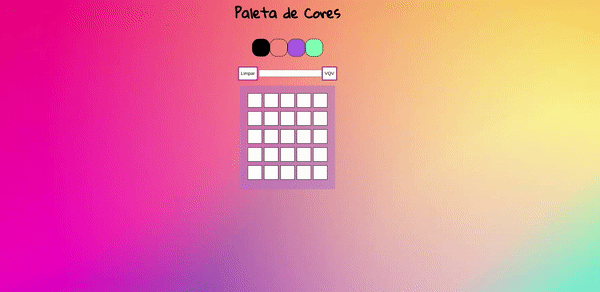

# Projeto Pixels art

### Sobre o projeto:

Nesse projeto desenvolvi uma página web que contém uma paleta de cores que poderá ser utilizada para criar desenhos em pixels, foi meu 3° projeto feito no primeiro módulo Fundamentos de Desenvolvimento Web da , com objetivo de verificar a capacidade de:

- Manipular JavaScript.
- Manipular CSS.
- Manipular DOM.
