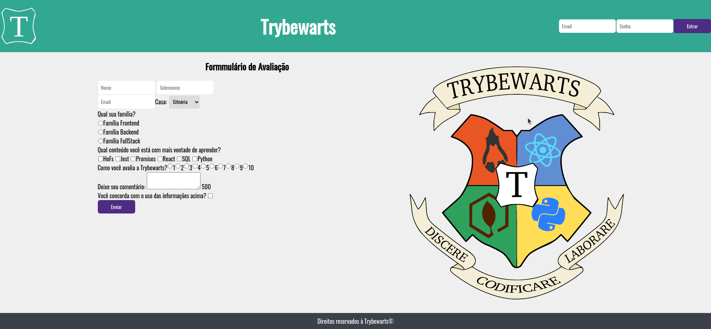

# Projeto Trybewarts

### Sobre o projeto:

Neste projeto eu desenvolvi um fomulário da Escola de Magia de Trybewarts, o tema desse projeto é baseado na obra 'Harry Potter', de J. K. Rowling. Foi meu 5° projeto do módulo de Fundamentos do Desenvolvimento Web na [Trybe](https://www.betrybe.com/) e o primeiro projeto em grupo, tive a oportunidade de desempenhar as habilidades de Soft Skills aprendidas no curso. Esse projeto teve como objetivo verificar a capacidade de:

- Criar formulários em HTML.
- Utilizar CSS flexbox.
