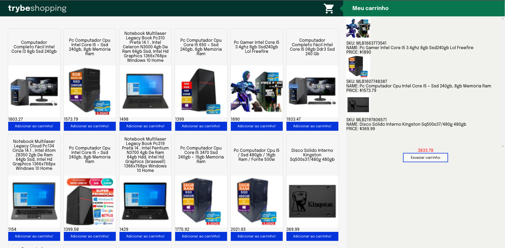

# Projeto Shopping Cart

### `npm install`
 Para instalar as depêncidas.

### `npm test`
  Testes dos requisitos solicitados no projeto pela [Trybe](https://www.betrybe.com/).
  
 ### Sobre o projeto.

Neste projeto eu desenvolvi um modelo de carrinho de compras, consumindo dados de uma API. Foi meu ultimo projeto no módulo de Fundamentos Desenvolvimento Web da [Trybe](https://www.betrybe.com/). Esse projeto teve como objetivo verificar a capacidade de:
- Fazer requisições a uma API do Mercado Livre.
- Utilizar conhecimentos em JavaScript, HTML e CSS.
- Utilizar funções assíncronas.
- Implementar testes unitários.
